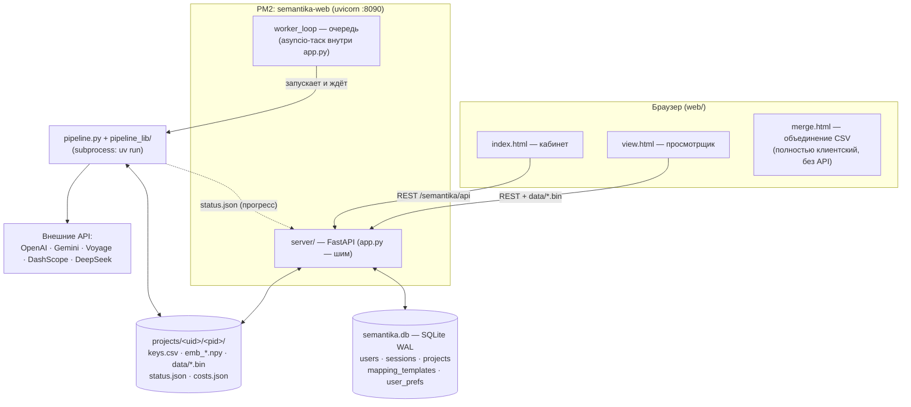

# Архитектура

## Компоненты и связи

Angie (nginx-форк) проксирует `https://neurosemantic.ru/semantika/api/` → `127.0.0.1:8090`
и отдаёт `web/` как статику `https://neurosemantic.ru/semantika/`.

## Кто с чем сцепляется

| Взаимодействие | Механизм | Контракт |
|---|---|---|
| Браузер ↔ app.py | fetch + cookie-сессия (`sem_sess`, scrypt-пароли) | JSON, префикс `/semantika/api` — [api.md](api.md) |
| app.py ↔ SQLite | синхронный sqlite3, WAL | схема в [data-formats.md](data-formats.md) |
| worker_loop → pipeline.py | `asyncio.create_subprocess_exec("uv", "run", "pipeline.py", pdir, ...)` | аргументы CLI + env с API-ключами (`pipeline_env()`) |
| pipeline.py → app.py | файл `status.json` в папке проекта (стадия + процент) | app.py читает его в `project_json()` для прогресс-бара |
| pipeline.py → браузер | файлы `data/` в папке проекта | `queries.json`, `meta.json`, `{variant}_{method}.bin`, `intents.json` — [data-formats.md](data-formats.md) |
| view.html ↔ данные проекта | `GET /projects/{pid}/data/{fname}` (whitelist-regex имён) | те же файлы, `cache: no-cache` |

## Жизненный цикл проекта

1. **Загрузка.** `POST /uploads`: файл декодируется (utf-8/cp1251), автоопределяются
   разделитель и колонки (`guess_mapping`); если подпись заголовка (sha1 первой строки)
   есть в `mapping_templates` — маппинг подставляется из шаблона. Сырой файл ложится
   в `uploads/<token>.txt`.
2. **Создание.** `POST /projects` с подтверждённым маппингом: `parse_upload_rows()`
   разбирает файл → `keys.csv` (канонический формат), строка в `projects`
   со `status='queued'`; маппинг сохраняется как шаблон (`save_template`).
3. **Очередь.** `worker_loop` (бесконечный asyncio-цикл, стартует на startup) берёт
   старейший `queued`-проект, ставит `running`, запускает `pipeline.py`.
4. **Пайплайн** ([pipeline.md](pipeline.md)) пишет прогресс в `status.json`,
   результаты в `data/`, расходы в `costs.json`. Код возврата 0 → `ready`,
   иначе `failed` (+ автодожим пропущенных вариантов при `retries < 3`).
5. **Просмотр.** view.html грузит `queries.json` + нужные `.bin`-деревья и всё
   остальное делает на клиенте ([frontend.md](frontend.md)).
6. **Пополнение.** `POST /projects/{pid}/append`: точные дубли схлопываются
   (max частот, OR флагов), новые фразы дописываются строго в конец `keys.csv` —
   благодаря этому кэши `emb_*.npy` остаются валидными и доэмбеддивается только хвост.
   Деревья и `meta.json` сносятся, проект снова `queued`.
7. **Интенты.** `POST /projects/{pid}/label` → `pipeline.py --label-only`: размечаются
   только фразы, отсутствующие в `phrase_intents.json`.

## Статусы проекта

`queued → running → ready | failed`. Recovery: `failed` можно перезапустить
(`POST /run`); прерванный `running` при рестарте процесса не возобновляется
автоматически — пользователь запускает заново, готовые деревья пропускаются
(skip-if-exists), эмбеддинги берутся из кэша, поэтому повтор почти бесплатен.

## Ограничения и допущения

- Один воркер: пайплайны выполняются последовательно (очередь FIFO).
- Лимиты: 100 000 фраз на проект, 5 проектов на пользователя, загрузка ≤ 50 МБ.
- Авторизация без подтверждения почты; rate-limit на auth-эндпоинты in-memory.
- Всё состояние — SQLite + файлы; внешних очередей/кэшей/брокеров нет.
